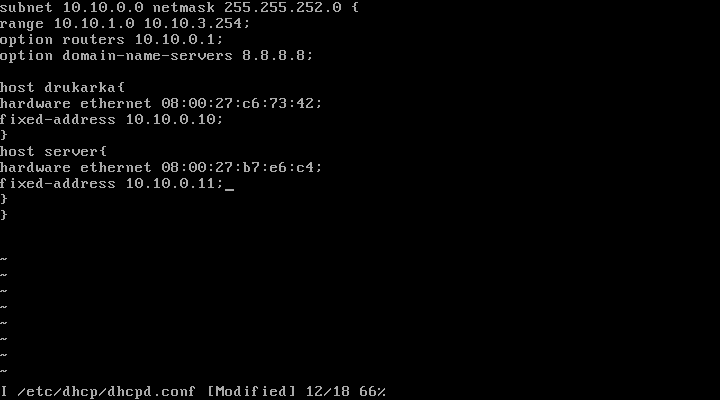
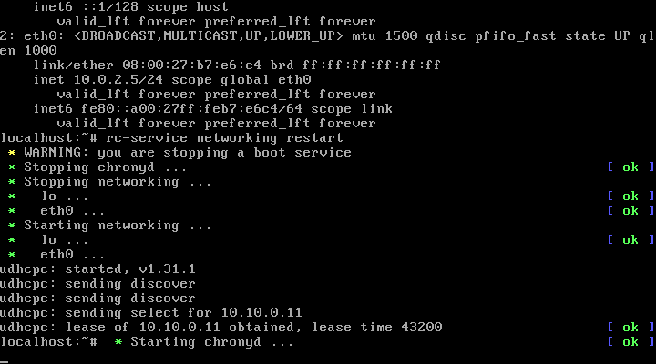
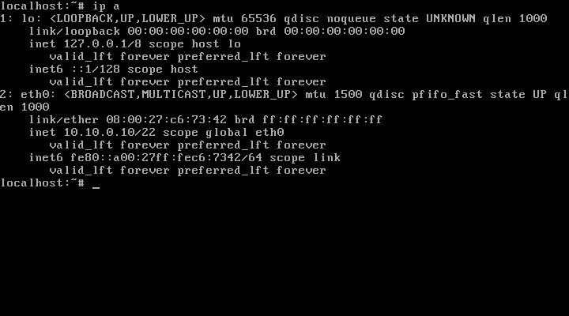
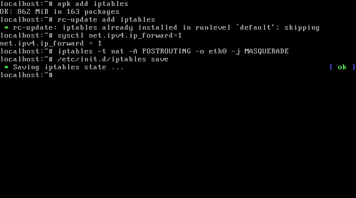
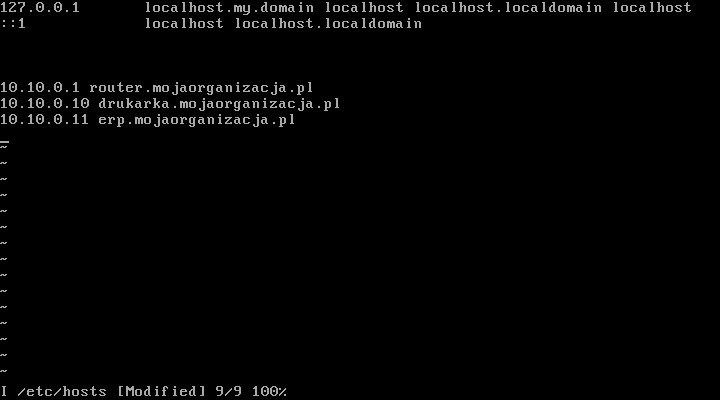
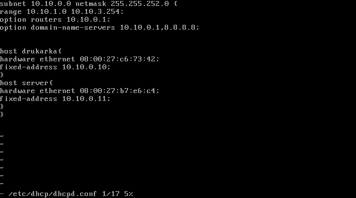
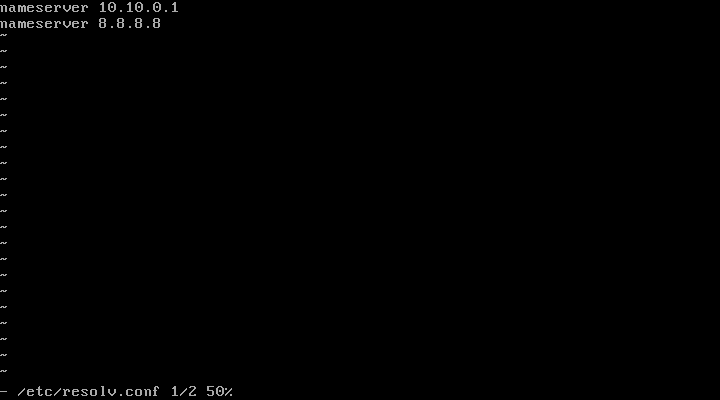
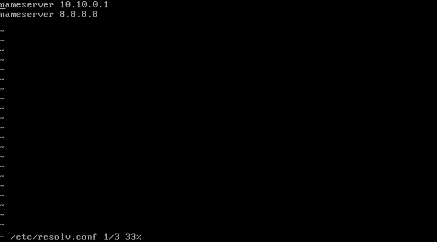
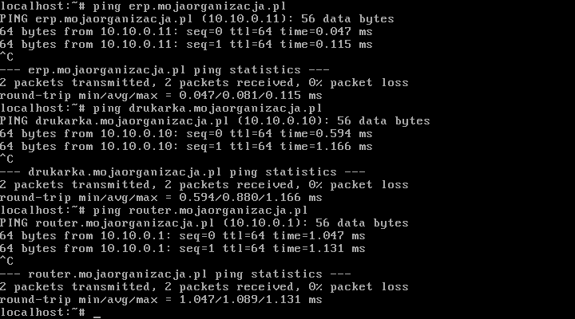

# 1) Wstęp: 
Ustalamy IP sieci: 10.10.0.0/22 

Maska: 255.255.252.0 

Pierwsze IP: 10.10.0.1– Gateway 

Host MAX IP: 10.10.3.254

Adres Rozgłoszeniowy: 10.10.3.254

IP Count: 1024 (1022 hostów)

IP Drukarki: 10.10.0.10/22

IP Urządzenia "Serwer": 10.10.0.11/22

# 2) Konfigurujemy INTERFACE Router_Nat

# 3) Konfigurujemy DHCP Router_nat: 8.8.8.8 – DNS google

# 4) Serwerowi oraz drukarce nadajemy adresy celem zminimalizowania potrzeby rekonfiguracji ustawień klientów

# 5) Konfigurujemy routing (iptables)

# 5)	Wprowadzamy translację pomiędzy Adresami IP oraz nazwami domenowymi dla kluczowych zasobów

