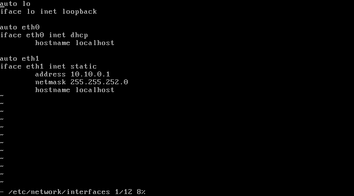
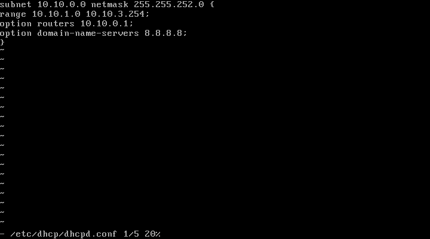

# 1) Wstęp: 
Ustalamy IP sieci: 10.10.0.0/22 

Maska: 255.255.252.0 

Pierwsze IP: 10.10.0.1– Gateway 

Host IP MAX IP: 10.10.3.254

Adres Rozgłoszeniowy: 10.10.3.254

IP Count: 1024 (1022 hostów)

# 2) Konfigurujemy INTERFACE Router_Nat

# 3) 3)	Konfigurujemy DHCP Router_nat: 8.8.8.8 – DNS google

